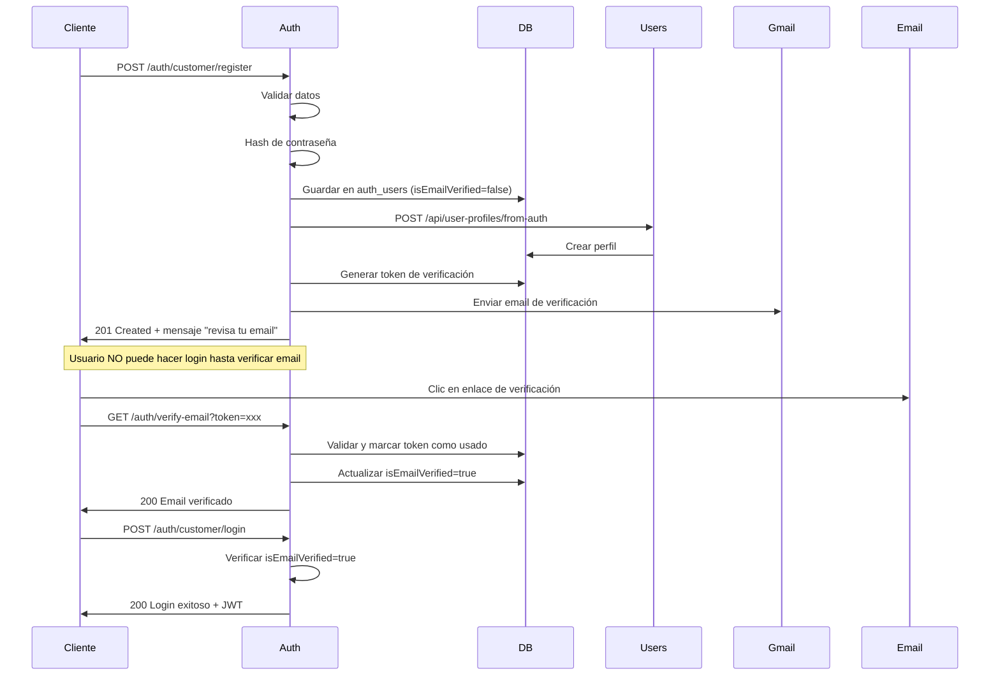
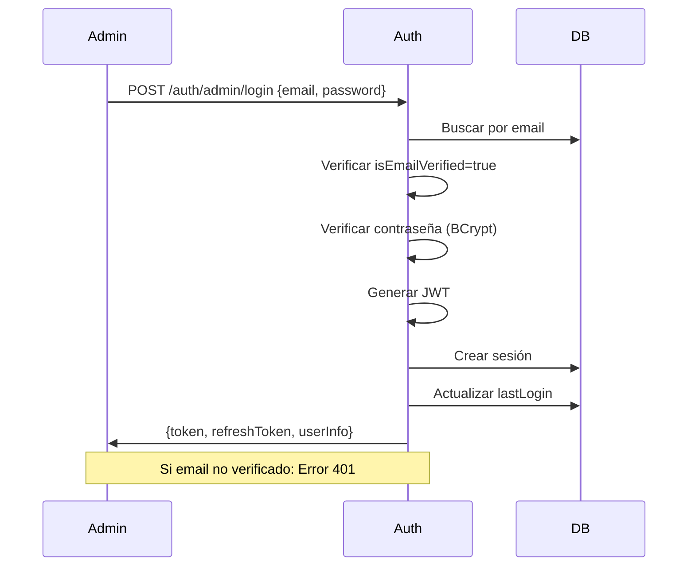

# 🔐 AUTH-SERVICE

## 📋 Descripción General

El AUTH-SERVICE es el **microservicio de autenticación y autorización** de PackedGo que maneja la gestión completa de usuarios y sesiones. Implementa autenticación diferenciada para administradores (email) y clientes (DNI), junto con funcionalidades de seguridad como JWT, recuperación de contraseñas y verificación de email.

### Características Principales:
- 🔑 Autenticación JWT con tokens de acceso y refresh
- 👥 Multi-tenant por tipo de usuario (Admin/Customer/Employee)
- 📧 Verificación de email con SendGrid
- 🔒 Recuperación segura de contraseñas
- 🛡️ Protección contra ataques de fuerza bruta
- 📊 Auditoría completa de intentos de login

## 🚀 Puerto de Servicio
**8081** (HTTP)
**5005** (Debug JDWP)

## 📦 Base de Datos
- **Nombre:** auth_db
- **Puerto:** 5433 (PostgreSQL 15)
- **Usuario:** auth_user
- **Imagen:** postgres:15-alpine

### Tablas principales:
  - `auth_users` - Usuarios del sistema
  - `user_sessions` - Sesiones activas
  - `email_verification_tokens` - Tokens de verificación de email
  - `password_recovery_tokens` - Tokens de recuperación de contraseña
  - `role_permissions` - Permisos por rol
  - `login_attempts` - Auditoría de intentos de login

## Funcionalidades Principales

### 1. Autenticación Diferenciada
- **Administradores:** Login con email + contraseña
- **Clientes:** Login con DNI + contraseña
- Validación automática de roles y permisos

### 2. Gestión de Usuarios
- Registro de clientes con validación completa
- Registro de administradores con código de autorización
- Verificación de disponibilidad de username, email y documento
- Verificación de email obligatoria

### 3. Seguridad Avanzada
- JWT tokens con tiempo de expiración configurable
- Refresh tokens para renovación automática
- Sistema de bloqueo de cuenta por intentos fallidos (5 intentos, 30 min bloqueo)
- Auditoría completa de intentos de login
- Validación de tokens para otros microservicios
- **✅ Verificación de email obligatoria antes del login**

### 4. Recuperación de Contraseñas
- Sistema seguro de reset con validación de email + DNI
- Tokens únicos con expiración de 1 hora
- Invalidación automática de sesiones tras cambio de contraseña

## Endpoints Principales

### AuthController (`/auth`)

#### Autenticación
- `POST /admin/login` - Login de administradores
- `POST /customer/login` - Login de clientes
- `POST /employee/login` - Login de empleados
- `POST /logout` - Cerrar sesión
- `POST /refresh` - Renovar token

#### Registro
- `POST /admin/register` - Registro de administradores
- `POST /customer/register` - Registro de clientes completo

#### Verificación y Recuperación
- `GET /verify-email?token=` - Verificar email
- `POST /resend-verification` - Reenviar email de verificación
- `POST /forgot-password` - Solicitar reset de contraseña
- `POST /reset-password` - Cambiar contraseña con token
- `POST /change-password/{userId}` - Cambiar contraseña (usuario logueado)

#### Gestión de Perfil
- `GET /user/{userId}` - Obtener perfil de usuario
- `PUT /user/{userId}` - Actualizar perfil de usuario

#### Validación de Tokens
- `POST /validate` - Validar token para otros microservicios

### UserController (`/users`)

#### Validación de Disponibilidad
- `GET /exists/username/{username}` - Verificar disponibilidad de username
- `GET /exists/email/{email}` - Verificar disponibilidad de email
- `GET /exists/document/{document}` - Verificar disponibilidad de documento

## Entities Principales

### AuthUser
```java
@Entity
@Table(name = "auth_users")
public class AuthUser {
    private Long id;
    private Long userProfileId;     // Referencia al users-service
    private String username;        // Único, requerido
    private String email;           // Único, opcional para clientes
    private Long document;          // Único, requerido para clientes
    private String passwordHash;    // Hash bcrypt
    private String role;           // ADMIN, SUPER_ADMIN, CUSTOMER
    private String loginType;      // EMAIL, DOCUMENT
    private Boolean isActive;
    private Boolean isEmailVerified;
    private Boolean isDocumentVerified;
    private LocalDateTime lastLogin;
    private Integer failedLoginAttempts;
    private LocalDateTime accountLockedUntil;
}
```

## 🚀 Tecnologías

- **Java 17** - Lenguaje de programación
- **Spring Boot 3.5.6** - Framework principal
- **Spring Data JPA** - Persistencia de datos
- **Spring Security** - Seguridad y autenticación
- **Spring Validation** - Validación de datos
- **Spring Mail** - Envío de emails
- **JWT (0.12.5)** - Autenticación basada en tokens
- **SendGrid 4.10.2** - Servicio de email transaccional
- **BCrypt** - Hash de contraseñas
- **ModelMapper 3.2.0** - Mapeo de objetos
- **PostgreSQL 15** - Base de datos
- **Lombok** - Reducción de boilerplate
- **Docker** - Contenedorización

## 🐳 Ejecución con Docker

### Desde el directorio raíz del backend:
```bash
docker-compose up -d auth-service
```

### Logs del servicio:
```bash
docker-compose logs -f auth-service
```

### Variables de entorno requeridas (.env):
```properties
# Server
SERVER_PORT=8081

# Database
DB_URL=jdbc:postgresql://auth-db:5432/auth_db
DB_USERNAME=auth_user
DB_PASSWORD=auth_password

# JWT
JWT_SECRET=your_jwt_secret_key_here
JWT_EXPIRATION=86400000  # 24 horas en milisegundos
JWT_REFRESH_EXPIRATION=604800000  # 7 días

# SendGrid
SENDGRID_API_KEY=your_sendgrid_api_key
SENDGRID_FROM_EMAIL=noreply@packedgo.com

# Users Service Integration
USERS_SERVICE_URL=http://users-service:8082

# Security
ADMIN_REGISTRATION_CODE=ADMIN2025SECRET  # Código para registro de admins
```

## 🔧 Desarrollo Local

### Requisitos:
- Java 17+
- Maven 3.8+
- PostgreSQL 15+ (o usar Docker)

### Ejecutar localmente:
```bash
./mvnw spring-boot:run
```

### Compilar:
```bash
./mvnw clean package
```

## 🔗 Integración con Otros Servicios

El Auth Service se comunica con:
- **USERS-SERVICE** (Puerto 8082) - Creación de perfiles de usuario tras registro

Otros servicios validan tokens con:
- **POST /auth/validate** - Endpoint de validación de tokens

## 🔐 Seguridad Implementada

### Hash de Contraseñas
- **Algoritmo:** BCrypt con salt automático
- **Factor de trabajo:** 10 rondas

### Tokens JWT
- **Algoritmo:** HS256 (HMAC con SHA-256)
- **Claims:** userId, username, email, role, loginType
- **Expiración:** Configurable (default 24h)

### Protección contra Fuerza Bruta
- **Intentos permitidos:** 5
- **Tiempo de bloqueo:** 30 minutos
- **Contador:** Por usuario y tipo de login

### Tokens de Verificación
- **Email Verification:** UUID único, expira en 24 horas
- **Password Recovery:** UUID único, expira en 1 hora
- **Invalidación:** Automática tras uso o expiración

## 📊 Flujos de Autenticación

### Registro de Cliente


### Login de Administrador


## ⚠️ Manejo de Errores

| Código | Escenario |
|--------|----------|
| 400 | Datos de entrada inválidos |
| 401 | Credenciales incorrectas o email no verificado |
| 403 | Cuenta no verificada o bloqueada |
| 409 | Usuario ya existe (username/email/documento) |
| 410 | Token expirado |
| 500 | Error interno del servidor |

## 📧 Sistema de Verificación de Email

### Flujo Actual (✅ IMPLEMENTADO)

1. **Registro:**
   - Usuario se registra (customer o admin)
   - Se crea con `isEmailVerified = false`
   - Se genera token de verificación (expira en 24 horas)
   - Se envía email con enlace de verificación a Gmail

2. **Bloqueo de Login:**
   - Si el usuario intenta hacer login sin verificar email
   - **Error 401:** "Por favor verifica tu email antes de iniciar sesión. Revisa tu bandeja de entrada para encontrar el enlace de verificación."
   - Login bloqueado hasta que verifique

3. **Verificación:**
   - Usuario hace clic en enlace del email
   - GET `/auth/verify-email?token=xxx`
   - Sistema valida token y marca `isEmailVerified = true`
   - Usuario puede hacer login normalmente

### Configuración de Email

**Servicio SMTP:** Gmail
```properties
MAIL_HOST=smtp.gmail.com
MAIL_PORT=587
MAIL_USERNAME=packedgo.events@gmail.com
MAIL_PASSWORD=oopk bpgu tllp uprg
EMAIL_FROM=packedgo.events@gmail.com
FRONTEND_BASE_URL=http://localhost:3000
```

### Template de Email

El email de verificación incluye:
- Logo de PackedGo
- Mensaje de bienvenida
- Botón con enlace de verificación
- Advertencia de expiración (24 horas)
- Diseño responsive HTML

**Ubicación:** `src/main/resources/templates/email/verification-email.html`

### Endpoints de Verificación

- `GET /auth/verify-email?token={token}` - Verificar email con token
- `POST /auth/resend-verification` - Reenviar email de verificación

### Particularidades

**Para Customers:**
- Email enviado a la dirección proporcionada en el registro

**Para Admins:**
- Email enviado siempre a `packedgo.events@gmail.com`
- Hardcoded en línea 329-331 de `AuthServiceImpl.java`

## 📝 Notas de Desarrollo

- Las sesiones se invalidan automáticamente tras logout
- Los refresh tokens permiten renovar el access token sin re-autenticarse
- Los empleados se autentican con DNI (similar a clientes)
- Los administradores requieren un código de autorización para registrarse
- Todos los endpoints de registro y login son públicos
- **✅ La verificación de email es obligatoria antes de hacer login (implementado 14/12/2025)**
- Los tokens de verificación expiran en 24 horas
- Los mensajes de error están en español
    private Integer failedLoginAttempts;
    private LocalDateTime lockedUntil;
    // ... campos de auditoría
}
```

### UserSession
Gestiona sesiones activas con tokens JWT y refresh tokens, incluyendo información del dispositivo e IP.

### EmailVerificationToken / PasswordRecoveryToken
Tokens temporales para verificación de email y recuperación de contraseñas con expiración automática.

## DTOs Principales

### Requests
- `CustomerRegistrationRequest` - Registro completo de cliente con datos personales
- `AdminRegistrationRequest` - Registro de admin con código de autorización
- `CustomerLoginRequest` - Login con documento + contraseña
- `AdminLoginRequest` - Login con email + contraseña
- `PasswordResetRequest` - Solicitud de reset con email + documento
- `ChangePasswordRequest` - Cambio de contraseña con token

### Responses
- `LoginResponse` - Token, refresh token, info de usuario y permisos
- `TokenValidationResponse` - Validación de token con permisos
- `ApiResponse<T>` - Wrapper estándar para todas las respuestas

## Servicios

### AuthService / AuthServiceImpl
- **loginAdmin()** - Autenticación de administradores con validación de email verificado
- **loginCustomer()** - Autenticación de clientes con validación de email verificado
- **registerCustomer()** - Registro completo + creación de perfil + envío de email de verificación
- **registerAdmin()** - Registro de admin con código de autorización + envío de email de verificación
- **validateToken()** - Validación de JWT con permisos
- **verifyEmail()** - Verificación de email con token (marca isEmailVerified=true)
- **requestPasswordReset()** - Generación de token de recuperación
- **resetPassword()** - Cambio de contraseña con token

### EmailService / EmailServiceImpl
- Envío de emails de verificación con templates HTML responsivos
- Envío de emails de recuperación de contraseña
- Configuración SMTP con Gmail (smtp.gmail.com:587)
- Uso de credenciales de aplicación de Gmail
- Generación automática de tokens UUID
- Links de verificación al frontend

### UsersServiceClient
- Cliente HTTP para comunicación con users-service
- Creación automática de perfil tras registro de cliente

## Configuración de Seguridad

### JWT Configuration
- Secret key configurable
- Tiempo de expiración: 1 hora (configurable)
- Refresh token: 30 días (configurable)
- Algoritmo HS256

### Password Security
- Bcrypt encoding con salt automático
- Validación de fortaleza mínima (6 caracteres)

### Account Security
- Máximo 5 intentos de login fallidos
- Bloqueo de cuenta por 30 minutos
- Auditoría completa de intentos

## Variables de Entorno

```bash
# Server Configuration
SERVER_PORT=8081

# Database Configuration
DATABASE_URL=jdbc:postgresql://auth-db:5432/auth_db
DATABASE_USER=auth_user
DATABASE_PASSWORD=secure_password

# JWT Configuration  
JWT_SECRET=your_jwt_secret_minimum_32_characters_here
JWT_EXPIRATION=3600000
JWT_REFRESH_EXPIRATION=2592000000

# Email Configuration
EMAIL_USERNAME=your_gmail@gmail.com
EMAIL_PASSWORD=your_gmail_app_password_here
EMAIL_FROM=noreply@packedgo.com

# External Services
USERS_SERVICE_URL=http://users-service:8082
FRONTEND_BASE_URL=http://localhost:8080
```

## Dependencias con Otros Servicios

### Users-Service
- **Outbound:** Creación automática de perfil tras registro de cliente
- **Endpoint:** `POST /api/user-profiles/from-auth`

### Todos los Microservicios
- **Inbound:** Validación de tokens JWT
- **Endpoint:** `POST /auth/validate`

## Seguridad y Validaciones

### Validaciones de Registro
- Username único, 3-50 caracteres
- Email válido y único para admins
- Documento único para clientes
- Contraseña mínimo 6 caracteres
- Campos personales obligatorios (nombre, apellido, fecha nacimiento, teléfono, género)

### Funcionalidades de Seguridad
- Rate limiting por IP en intentos de login
- Tokens únicos no reutilizables para verificación/reset
- Invalidación de sesiones en cascada
- Logging completo de eventos de seguridad
- Validación de autorización por código para admins

## Patrones Implementados
- Repository Pattern para acceso a datos
- Service Layer para lógica de negocio
- DTO Pattern para transferencia de datos
- Builder Pattern para construcción de objetos
- Global Exception Handler para manejo de errores

## Características Especiales
- Autenticación diferenciada por tipo de usuario
- Sistema de permisos granular por rol
- Integración automática con users-service
- Templates HTML para emails responsivos
- Auditoría completa de eventos de autenticación
- Sistema robusto de recuperación de cuentas