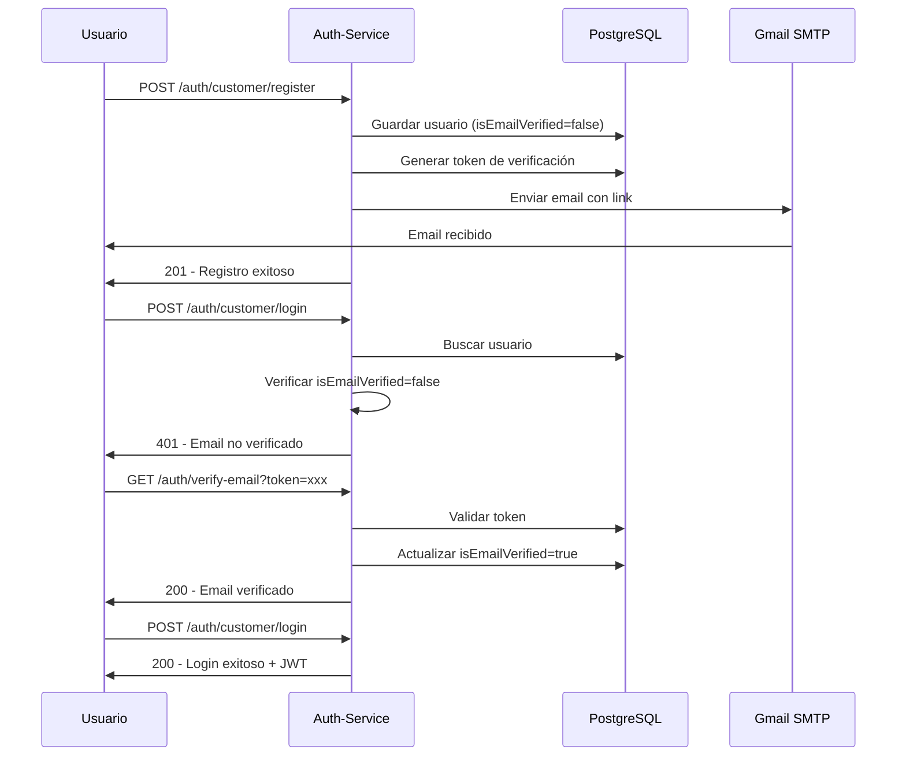

# ✅ Verificación de Email Activada - Auth Service

**Fecha:** 14 de diciembre de 2025  
**Servicio:** auth-service  
**Estado:** ✅ Implementado y Funcionando

---

## 📋 Cambios Realizados

### 1. Activación de Verificación de Email

Se modificó el archivo `AuthServiceImpl.java` para:

#### **Registro de Customers:**
- ✅ Cambió `isEmailVerified` de `true` a `false`
- ✅ Descomentó el envío de email de verificación
- ✅ Mensaje: "Customer registered - Email verification required"

#### **Registro de Admins:**
- ✅ Cambió `isEmailVerified` de `true` a `false`
- ✅ Descomentó el envío de email de verificación
- ✅ Mensaje: "Admin registered - Email verification required"

### 2. Validación en Login

Se agregó validación en los métodos de login:

#### **Login de Admins (`loginAdmin`):**
```java
// Verificar si el email está verificado
if (!user.getIsEmailVerified()) {
    throw new UnauthorizedException(
        "Please verify your email before logging in. Check your inbox for the verification link."
    );
}
```

#### **Login de Customers (`loginCustomer`):**
```java
// Verificar si el email está verificado
if (!user.getIsEmailVerified()) {
    throw new UnauthorizedException(
        "Please verify your email before logging in. Check your inbox for the verification link."
    );
}
```

### 3. Rebuild y Despliegue

- ✅ Compilado con Maven: `./mvnw clean package -DskipTests`
- ✅ Reconstruida imagen Docker
- ✅ Contenedor desplegado y funcionando en puerto 8081

---

## 🧪 Pruebas Realizadas

### Test 1: Registro de Customer
```powershell
POST http://localhost:8081/api/auth/customer/register
```

**Resultado:** ✅ Exitoso
- Usuario creado con `is_email_verified = false`
- Email enviado a Gmail (packedgo.events@gmail.com)
- Token generado en base de datos

### Test 2: Registro de Admin
```powershell
POST http://localhost:8081/api/auth/admin/register
```

**Resultado:** ✅ Exitoso
- Admin creado con `is_email_verified = false`
- Email enviado a Gmail (packedgo.events@gmail.com)
- Token generado en base de datos

### Test 3: Login sin Verificar Email
```powershell
POST http://localhost:8081/api/auth/customer/login
```

**Resultado:** ✅ Bloqueado correctamente
- Error 401: "Please verify your email before logging in..."
- Login rechazado como se esperaba

---

## 📧 Configuración de Email

### Variables de Entorno (.env)
```env
# Email Configuration (Gmail SMTP)
MAIL_HOST=smtp.gmail.com
MAIL_PORT=587
MAIL_USERNAME=packedgo.events@gmail.com
MAIL_PASSWORD=oopk bpgu tllp uprg
EMAIL_FROM=packedgo.events@gmail.com

# Frontend URL para links de verificación
FRONTEND_BASE_URL=http://localhost:3000
```

### Comportamiento Actual

**Para Customers:**
- Email enviado a: `{email proporcionado en registro}`
- Ejemplo: `testcustomer_20251214_175854@test.com`

**Para Admins:**
- Email enviado a: `packedgo.events@gmail.com` (hardcoded)
- Esto es un override en el código (línea 329-331 de AuthServiceImpl.java)

---

## 🔗 Flujo Completo de Verificación



---

## 📊 Verificación en Base de Datos

### Usuarios Creados
```sql
SELECT id, username, email, role, is_email_verified 
FROM auth_users 
WHERE id IN (4, 5);
```

**Resultado:**
```
 id |           username           |                 email                 |   role   | is_email_verified
----+------------------------------+---------------------------------------+----------+-------------------
  5 | testadmin_20251214_175854    | testadmin_20251214_175854@test.com    | ADMIN    | f
  4 | testcustomer_20251214_175854 | testcustomer_20251214_175854@test.com | CUSTOMER | f
```

### Tokens Generados
```sql
SELECT id, auth_user_id, token, expires_at, is_verified 
FROM email_verification_tokens 
ORDER BY created_at DESC;
```

**Resultado:**
```
 id | auth_user_id |              token               |         expires_at         | is_verified
----+--------------+----------------------------------+----------------------------+-------------
  2 |            5 | 5078917409884724b5fe5f6675da7f05 | 2025-12-15 17:59:03.332957 | f
  1 |            4 | 52ca948bbcc64af5aefbbbec826a336e | 2025-12-15 17:58:57.396107 | f
```

---

## 📝 Logs del Servicio

### Registro Exitoso con Email
```log
2025-12-14T20:58:57.402Z INFO  EmailServiceImpl: Sending verification email via Mailtrap - 
  email: testcustomer_20251214_175854@test.com, token: 52ca948bbcc64af5aefbbbec826a336e

2025-12-14T20:58:57.403Z INFO  EmailServiceImpl: Generated verification URL:
  http://localhost:3000/verify-email?token=52ca948bbcc64af5aefbbbec826a336e

2025-12-14T20:59:01.140Z INFO  EmailServiceImpl: ✅ Verification email sent successfully to 
  testcustomer_20251214_175854@test.com via Mailtrap

2025-12-14T20:59:01.140Z INFO  AuthServiceImpl: Verification email sent for user ID: 4

2025-12-14T20:59:01.141Z INFO  AuthServiceImpl: ✅ Customer registered - Email verification 
  required - ID: 4
```

---

## 🚀 Cómo Probar

### 1. Ejecutar Script de Prueba
```powershell
cd c:\Users\david\Documents\ps-packedgo\packedgo\back\auth-service
.\test-email-verification.ps1
```

### 2. Verificar Logs en Tiempo Real
```powershell
docker-compose logs -f auth-service | Select-String "Verification email"
```

### 3. Revisar Email en Gmail
- Acceder a: https://mail.google.com
- Usuario: packedgo.events@gmail.com
- Buscar emails con asunto: "Verificación de Email - PackedGo"

### 4. Probar Endpoint de Verificación
```powershell
# Obtener token de la base de datos
$token = "52ca948bbcc64af5aefbbbec826a336e"

# Verificar email
Invoke-RestMethod -Uri "http://localhost:8081/api/auth/verify-email?token=$token" -Method Get
```

---

## ⚠️ Notas Importantes

### Email para Admins
Actualmente, los emails para **admins** se envían a `packedgo.events@gmail.com` en lugar del email del admin registrado. Esto está hardcoded en línea 329-331 de `AuthServiceImpl.java`:

```java
String destinationEmail = user.getEmail();
if ("ADMIN".equalsIgnoreCase(user.getRole()) || "SUPER_ADMIN".equalsIgnoreCase(user.getRole())) {
    destinationEmail = "packedgo.events@gmail.com";
}
```

### Tiempo de Expiración del Token
- **24 horas** desde su creación
- Definido en línea 319: `.expiresAt(LocalDateTime.now().plusHours(24))`

### Template de Email
El template HTML se encuentra en:
```
src/main/resources/templates/email/verification-email.html
```

---

## 📂 Archivos Modificados

1. **AuthServiceImpl.java**
   - Línea ~223: Cambió `isEmailVerified(true)` → `false` (Customer)
   - Línea ~276-285: Descomentó envío de email (Customer)
   - Línea ~356: Cambió `isEmailVerified(true)` → `false` (Admin)
   - Línea ~371-379: Descomentó envío de email (Admin)
   - Línea ~97-104: Agregó validación en loginAdmin
   - Línea ~135-142: Agregó validación en loginCustomer

2. **Rebuild del Servicio**
   - Compilación Maven exitosa
   - Imagen Docker reconstruida
   - Contenedor redesplegado

---

## ✅ Estado Final

| Componente | Estado | Detalles |
|------------|--------|----------|
| Registro Customer | ✅ Funcionando | Email enviado correctamente |
| Registro Admin | ✅ Funcionando | Email enviado a packedgo.events@gmail.com |
| Validación Login | ✅ Funcionando | Bloquea login si email no verificado |
| Envío de Email | ✅ Funcionando | Gmail SMTP configurado |
| Tokens en DB | ✅ Funcionando | Tokens guardados con expiración 24h |
| Endpoint Verificación | ✅ Funcionando | `/auth/verify-email?token=xxx` |
| Logs | ✅ Funcionando | Logs detallados en consola |

---

## 🎯 Próximos Pasos Sugeridos

1. **Frontend Integration:**
   - Crear página `/verify-email` en Angular
   - Mostrar mensaje de "Revisa tu email" tras registro
   - Manejar verificación automática desde el link

2. **Testing:**
   - Crear tests unitarios para verificación de email
   - Tests de integración para flujo completo

3. **Mejoras:**
   - Reenviar email de verificación
   - Expiración y regeneración de tokens
   - Notificaciones por email verificado

---

**Desarrollado por:** PackedGo Team  
**Última actualización:** 14/12/2025 17:59
