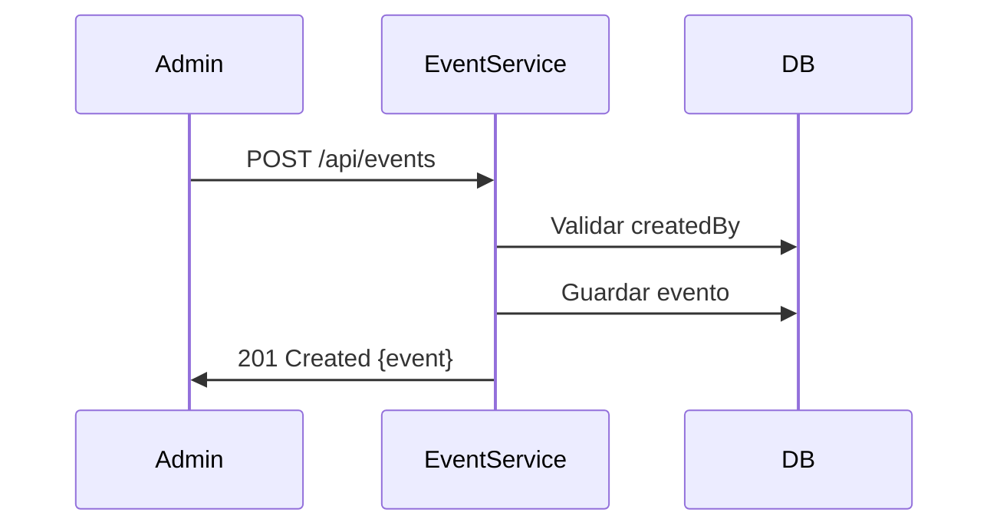
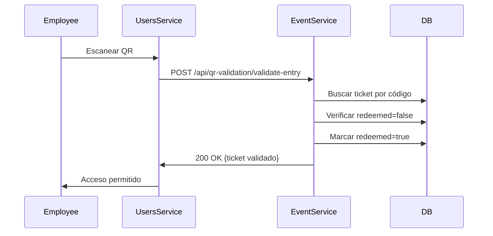
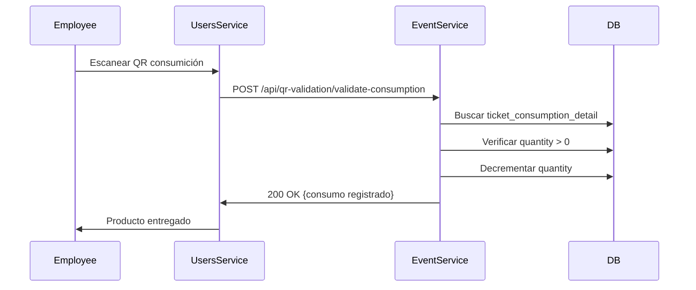

# 🎉 EVENT-SERVICE

## 📋 Descripción General

El EVENT-SERVICE es el **núcleo de la gestión de eventos** en PackedGo. Se encarga de la creación y administración de eventos, consumiciones, tickets y la validación de accesos mediante códigos QR. Implementa la lógica de negocio principal para organizadores y el control de stock.

### Características Principales:
- 📅 Gestión completa de eventos (CRUD multi-tenant)
- 🍔 Gestión de consumiciones y categorías
- 🎫 Sistema de tickets y passes pre-generados
- 📱 Validación QR para entrada y consumos
- 📊 Control de stock en tiempo real
- 🔐 Autenticación JWT para operaciones sensibles

## 🚀 Puerto de Servicio
**8086** (HTTP)
**5007** (Debug JDWP)

## 📦 Base de Datos
- **Nombre:** event_db
- **Puerto:** 5435 (PostgreSQL 15)
- **Usuario:** event_user
- **Imagen:** postgres:15-alpine

### Tablas principales:
  - `events` - Eventos
  - `event_categories` - Categorías de eventos
  - `consumptions` - Consumiciones (productos)
  - `consumption_categories` - Categorías de consumiciones
  - `passes` - Entradas pre-generadas
  - `tickets` - Tickets comprados por usuarios
  - `ticket_consumptions` - Paquetes de consumiciones de tickets
  - `ticket_consumption_details` - Detalle de consumiciones por ticket

## 🚀 Tecnologías

- **Java 17** - Lenguaje de programación
- **Spring Boot 3.5.6** - Framework principal
- **Spring Data JPA** - Persistencia de datos
- **Spring Web** - API REST
- **Spring Actuator** - Monitoreo y métricas
- **JWT (0.11.5)** - Autenticación (validación básica)
- **PostgreSQL 15** - Base de datos
- **Lombok** - Reducción de boilerplate
- **Docker** - Contenedorización

## Funcionalidades Principales

### 1. Gestión de Eventos
- CRUD completo de eventos (Multi-tenant por `createdBy`)
- Gestión de categorías de eventos
- Control de capacidad y fechas

### 2. Gestión de Consumiciones
- CRUD de productos/consumiciones
- Categorización (Bebidas, Comidas, etc.)
- Asociación de precios y stock

### 3. Sistema de Tickets y Passes
- Generación de Passes (entradas disponibles)
- Emisión de Tickets (compra de usuario)
- Vinculación de consumiciones a tickets

### 4. Validación QR
- Validación de entrada al evento (Single Entry)
- Canje progresivo de consumiciones
- Control de stock en tiempo real durante el evento

## Endpoints Principales

### EventController (`/api/events`)
- `GET /` - Listar eventos (público)
- `GET /{id}` - Obtener evento por ID
- `POST /` - Crear evento (Admin)
- `PUT /{id}` - Actualizar evento
- `DELETE /{id}` - Eliminar evento
- `GET /organizer/my-events` - Eventos del organizador logueado

### ConsumptionController (`/api/consumptions`)
- `GET /` - Listar consumiciones
- `POST /` - Crear consumición
- `PUT /{id}` - Actualizar consumición
- `DELETE /{id}` - Eliminar consumición

### TicketController (`/api/tickets`)
- `POST /` - Crear ticket (compra)
- `GET /{id}` - Obtener ticket
- `GET /user/{userId}` - Tickets de un usuario

### QRValidationController (`/api/qr-validation`)
- `POST /validate-entry` - Validar entrada (usado por users-service)
- `POST /validate-consumption` - Validar/Canjear consumición (usado por users-service)

### PassController (`/api/passes`)
- `POST /generate-for-event/{eventId}` - Generar passes para un evento
- `GET /event/{eventId}` - Obtener passes de un evento

## Entities Principales

### Event
```java
@Entity
@Table(name = "events")
public class Event {
    private Long id;
    private String name;
    private String description;
    private LocalDateTime eventDate;
    private Double lat;
    private Double lng;
    private Integer maxCapacity;
    private BigDecimal basePrice;
    private Long createdBy; // ID del organizador (Multi-tenant)
    // ...
}
```

### Ticket
Representa la entrada comprada por un usuario. Contiene el estado `redeemed` para controlar el acceso.

### TicketConsumptionDetail
Controla el saldo de cada consumición individual dentro de un ticket.

## Variables de Entorno

```bash
# Server Configuration
SERVER_PORT=8086

# Database Configuration
DATABASE_URL=jdbc:postgresql://event-db:5432/event_db
DATABASE_USER=event_user
DATABASE_PASSWORD=event_password

# Security (si aplica)
JWT_SECRET=your_jwt_secret
```

## 🐳 Ejecución con Docker

### Desde el directorio raíz del backend:
```bash
docker-compose up -d event-service
```

### Logs del servicio:
```bash
docker-compose logs -f event-service
```

### Reconstruir imagen:
```bash
docker-compose up -d --build event-service
```

## 🔧 Desarrollo Local

### Requisitos:
- Java 17+
- Maven 3.8+
- PostgreSQL 15+ (o usar Docker)

### Ejecutar localmente:
```bash
./mvnw spring-boot:run
```

### Compilar:
```bash
./mvnw clean package
```

### Aplicar migraciones SQL:
El servicio incluye varios scripts de migración en el directorio raíz:
- `migration_many_to_many.sql` - Relación eventos-consumiciones
- `migration_add_start_end_time.sql` - Horarios de eventos
- `migration_add_description_to_event_categories.sql`
- `fix_inactive_categories_and_events.sql`

Ejecutar manualmente en PostgreSQL según necesidad.

## Dependencias con Otros Servicios

### Users-Service
- **Inbound:** Recibe peticiones de validación QR desde el dashboard de empleados.
- **Endpoints usados:** `/api/qr-validation/validate-entry`, `/api/qr-validation/validate-consumption`

### Order-Service
- **Inbound:** Recibe peticiones para generar tickets tras una compra exitosa.
- **Endpoint usado:** Creación de tickets asociados a órdenes

## 🔐 Seguridad

**Nota:** El servicio tiene Spring Security comentado en el `pom.xml`, pero incluye validación JWT básica.

### Endpoints Públicos:
- `GET /api/events` - Listar eventos
- `GET /api/events/{id}` - Detalle de evento
- `GET /api/consumptions` - Listar consumiciones

### Endpoints Protegidos (requieren JWT):
- Todos los endpoints de creación, actualización y eliminación
- Validación QR (solo empleados/admins)
- Gestión de passes

## 📊 Validaciones y Reglas de Negocio

### Multi-Tenancy
- Los eventos y consumiciones están vinculados al `createdBy` (ID del organizador).
- Un organizador solo puede modificar sus propios recursos.
- Validación automática en operaciones de actualización/eliminación.

### Validación QR

#### Entrada al Evento:
- Solo se permite **un ingreso por ticket** (`redeemed` flag).
- Una vez canjeado, el ticket no puede reutilizarse para entrada.
- Se valida que el ticket pertenezca al evento correcto.

#### Consumo de Productos:
- Se decrementa la cantidad disponible en `ticket_consumption_details`.
- No se permite canjear si el saldo de la consumición es 0.
- Control de stock en tiempo real durante el evento.
- Cada consumición se registra con timestamp.

### Control de Capacidad:
- Los eventos tienen `maxCapacity` definida.
- No se pueden emitir más tickets que la capacidad máxima.
- Validación antes de permitir compras.

## 🔄 Flujos Principales

### Creación de Evento


### Validación de Entrada QR


### Canje de Consumición


## 📝 Notas de Desarrollo

- El servicio maneja relaciones **many-to-many** entre eventos y consumiciones.
- Los passes son entradas pre-generadas disponibles para venta.
- Los tickets son la representación de passes comprados por usuarios.
- Cada ticket puede tener múltiples consumiciones asociadas.
- Las categorías (eventos y consumiciones) soportan soft-delete.
- Spring Security está deshabilitado pero se mantiene validación JWT.

## ⚠️ Manejo de Errores

| Código | Escenario |
|--------|----------|
| 200 | Operación exitosa |
| 201 | Recurso creado |
| 400 | Datos inválidos |
| 403 | Sin permiso (no es el creador) |
| 404 | Recurso no encontrado |
| 409 | Conflicto (ticket ya canjeado, sin stock) |
| 500 | Error interno del servidor |

## 🗄️ Scripts de Base de Datos

Archivos SQL disponibles en el directorio del servicio:
- `insert_employee.sql` - Datos de prueba de empleados
- `seed_events.sql` - Eventos de ejemplo
- `seed_consumptions.sql` - Consumiciones de ejemplo
- `seeding_consumptions.sql` - Más datos de consumiciones
- `MIGRACION_MULTITENANT_REFERENCIA.sql` - Referencia para multi-tenancy
