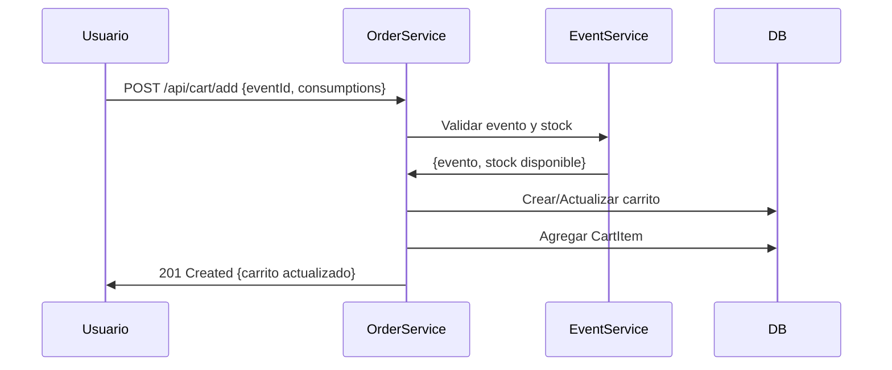
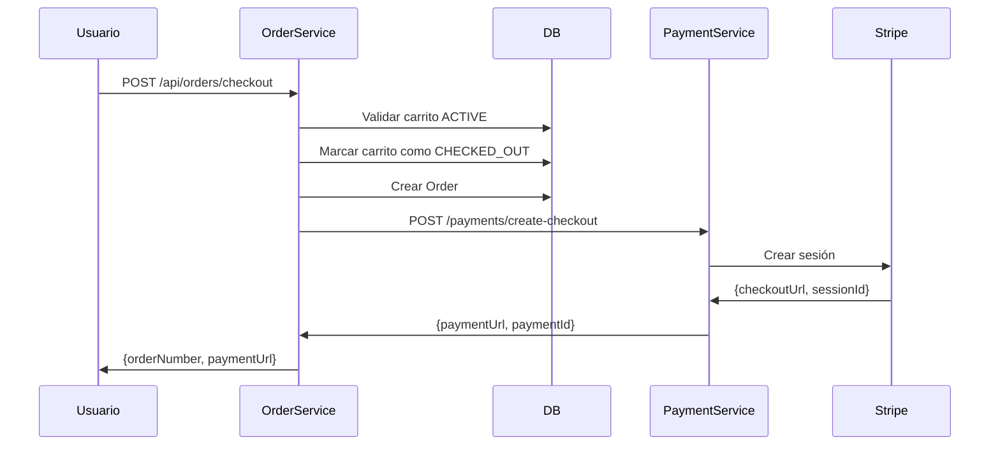

# 🛒 ORDER-SERVICE

Microservicio para gestión de carritos de compra y órdenes del sistema PackedGo.

## 📋 Descripción

ORDER-SERVICE maneja el flujo completo de compras en PackedGo:
- ✅ Creación y gestión de carritos de compra
- ✅ Expiración automática de carritos (10 minutos)
- ✅ Integración con EVENT-SERVICE para validar stock
- ✅ Generación de órdenes y checkout
- ✅ Validación JWT para autenticación
- ✅ Limpieza automática de carritos expirados
- ✅ Integración con Payment Service para procesamiento de pagos

### Características Principales:
- 🛍️ Carrito de compra con múltiples items
- ⏱️ Expiración automática (10 min de inactividad)
- 📦 Validación de stock en tiempo real
- 💳 Checkout con integración a pasarela de pagos
- 🧹 Limpieza programada de datos antiguos
- 🔐 Seguridad JWT en todos los endpoints

## 🚀 Puerto de Servicio
**8084** (HTTP)
**5008** (Debug JDWP)

## 📦 Base de Datos
- **Nombre:** order_db
- **Puerto:** 5436 (PostgreSQL 15)
- **Usuario:** order_user
- **Imagen:** postgres:15-alpine

### Tablas principales:
- `shopping_carts` - Carrito principal del usuario
- `cart_items` - Items individuales (eventos) en el carrito
- `cart_item_consumptions` - Consumos asociados a cada item
- `orders` - Órdenes generadas (TBD si se usa esta tabla)

## 🚀 Tecnologías

- **Java 17** - Lenguaje de programación
- **Spring Boot 3.5.6** - Framework
- **Spring Data JPA** - Persistencia
- **PostgreSQL 15** - Base de datos
- **WebClient** - Cliente HTTP reactivo
- **JWT** - Autenticación
- **ModelMapper** - Conversión DTOs
- **Lombok** - Reducción de boilerplate
- **Docker** - Contenedorización

## 🏗️ Arquitectura

```
order-service/
├── controller/       # Endpoints REST
│   ├── CartController.java
│   └── OrderController.java
├── service/          # Lógica de negocio
│   ├── CartService.java
│   ├── OrderService.java
│   └── impl/
├── repository/       # Acceso a datos
│   ├── ShoppingCartRepository.java
│   ├── CartItemRepository.java
│   └── OrderRepository.java
├── entity/           # Entidades JPA
│   ├── ShoppingCart.java
│   ├── CartItem.java
│   ├── CartItemConsumption.java
│   └── Order.java
├── dto/              # DTOs (request/response/external)
│   ├── request/
│   ├── response/
│   └── external/
├── external/         # Clientes HTTP
│   └── EventServiceClient.java
├── config/           # Configuraciones
│   ├── WebClientConfig.java
│   └── ModelMapperConfig.java
├── security/         # JWT validation
│   └── JwtTokenValidator.java
├── exception/        # Manejo de errores
│   └── GlobalExceptionHandler.java
└── util/             # Utilidades
    └── JwtUtil.java
```

## 📊 Modelo de Datos

### ShoppingCart
```java
@Entity
@Table(name = "shopping_carts")
public class ShoppingCart {
    private Long id;
    private Long userId;                    // ID del usuario
    private CartStatus status;              // ACTIVE, EXPIRED, CHECKED_OUT
    private LocalDateTime createdAt;
    private LocalDateTime expiresAt;        // +10 minutos desde creación
    private List<CartItem> items;
    // totalAmount calculado dinámicamente
}
```

### CartItem
```java
@Entity
@Table(name = "cart_items")
public class CartItem {
    private Long id;
    private Long eventId;                   // Referencia al evento
    private Integer quantity;               // Cantidad de tickets
    private BigDecimal unitPrice;           // Precio del evento
    private List<CartItemConsumption> consumptions;
    // subtotal calculado: unitPrice * quantity + sum(consumptions)
}
```

### Estados del Carrito
```java
public enum CartStatus {
    ACTIVE,      // Carrito activo, puede modificarse
    EXPIRED,     // Expirado por timeout (10 min)
    CHECKED_OUT  // Convertido a orden, no modificable
}
```

## 🔄 Flujos Principales

### Agregar al Carrito


### Checkout


## 📜 Migraciones SQL

El servicio incluye migraciones para funcionalidad de sesiones robustas:

### migration_add_session_token.sql
- Agrega campo `sessionToken` a las órdenes
- Permite rastrear sesiones de pago de Stripe
- Índice para búsquedas rápidas

### migration_robust_session.sql
- Mejoras adicionales al sistema de sesiones
- Campos de auditoría y seguimiento

**Ubicación:** `./order-service/`

**Aplicar manualmente:**
```bash
psql -h localhost -p 5436 -U order_user -d order_db -f migration_add_session_token.sql
```

## 📦 Base de Datos

### Tablas

**shopping_carts**
- Carrito principal del usuario
- Expiración automática a 10 minutos
- Estados: ACTIVE, EXPIRED, CHECKED_OUT
- Relación 1:N con cart_items

**cart_items**
- Items individuales (eventos) en el carrito
- Cálculo automático de subtotales
- Relación con consumos 1:N

**cart_item_consumptions**
- Consumos asociados a cada item
- Cantidad y precios individuales
- Vinculados a consumiciones del event-service

**orders** (opcional)
- Órdenes generadas tras checkout
- Estado del pago
- Referencia a carrito original

## 🔌 API Endpoints

### Carrito de Compras

**POST** `/api/cart/add`
```json
Headers: Authorization: Bearer {token}
Body: {
  "eventId": 1,
  "consumptions": [
    { "consumptionId": 1, "quantity": 2 },
    { "consumptionId": 2, "quantity": 1 }
  ]
}
Response: 201 CREATED
```

**GET** `/api/cart`
```json
Headers: Authorization: Bearer {token}
Response: 200 OK
{
  "id": 1,
  "userId": 123,
  "status": "ACTIVE",
  "expiresAt": "2025-10-18T15:30:00",
  "items": [...],
  "totalAmount": 150.00,
  "itemCount": 2,
  "expired": false
}
```

**DELETE** `/api/cart/items/{itemId}`
```
Headers: Authorization: Bearer {token}
Response: 200 OK (carrito actualizado) o 204 NO CONTENT (vacío)
```

**DELETE** `/api/cart`
```
Headers: Authorization: Bearer {token}
Response: 204 NO CONTENT
```

**PUT** `/api/cart/items/{itemId}`
```json
Headers: Authorization: Bearer {token}
Body: { "quantity": 3 }
Response: 200 OK
```

### Gestión de Órdenes

**POST** `/api/orders/checkout`
```json
Headers: Authorization: Bearer {token}
Body: {
  "adminId": 1,
  "successUrl": "...",
  "failureUrl": "...",
  "pendingUrl": "..."
}
Response: 201 CREATED
{
  "paymentUrl": "https://www.mercadopago.com.ar/checkout/v1/redirect?...",
  "orderNumber": "ORD-202510-123"
}
```

**POST** `/api/orders/checkout/single`
```json
Headers: Authorization: Bearer {token}
Body: { "adminId": 123 }
Response: 201 CREATED
```

**GET** `/api/orders`
```json
Headers: Authorization: Bearer {token}
Response: 200 OK
[
  {
    "id": 1,
    "orderNumber": "ORD-202510-123",
    "status": "PENDING",
    "totalAmount": 150.00,
    "createdAt": "2025-10-18T15:30:00",
    "items": [...]
  }
]
```

**GET** `/api/orders/{orderNumber}`
```json
Headers: Authorization: Bearer {token}
Response: 200 OK
```

**GET** `/api/orders/organizer/{organizerId}`
```json
Response: 200 OK
```

**POST** `/api/orders/payment-callback`
```json
Body: { "orderNumber": "ORD-202510-123", "paymentStatus": "APPROVED" }
Response: 200 OK
```

## 🐳 Docker

### Construcción Local

```bash
# Desde el directorio order-service
docker build -t order-service:latest .
```

### Ejecutar con Docker Compose

```bash
# Desde el directorio back/
docker-compose up -d order-service order-db

# Ver logs
docker-compose logs -f order-service

# Detener
docker-compose down
```

### Ejecutar TODO el sistema

```bash
# Desde el directorio back/
docker-compose up -d

# Servicios incluidos:
# - auth-service (8081)
# - users-service (8082)
# - event-service (8086)
# - order-service (8084)
# - payment-service (8087)
# - Todas las bases de datos
```

## 🔧 Variables de Entorno

Archivo `.env`:

```bash
# JWT
JWT_SECRET=your_super_secret_jwt_key_here

# Database
POSTGRES_DB=orders_db
POSTGRES_USER=orders_user
POSTGRES_PASSWORD=orders_password

# External Services
EVENT_SERVICE_URL=http://event-service:8086/api
AUTH_SERVICE_URL=http://auth-service:8081/api

# Cart Config
CART_EXPIRATION_MINUTES=10
CART_CLEANUP_INTERVAL_MINUTES=5
```

## 🏃 Ejecución Local (sin Docker)

### Prerrequisitos

1. Java 17
2. Maven 3.8+
3. PostgreSQL 15 (puerto 5436)
4. EVENT-SERVICE corriendo (puerto 8086)
5. AUTH-SERVICE corriendo (puerto 8081)

### Base de Datos

```sql
CREATE DATABASE orders_db;
CREATE USER orders_user WITH PASSWORD 'orders_password';
GRANT ALL PRIVILEGES ON DATABASE orders_db TO orders_user;
```

### Ejecución

```bash
# Instalar dependencias
./mvnw clean install

# Ejecutar
./mvnw spring-boot:run

# O con JAR
./mvnw package
java -jar target/order-service-0.0.1-SNAPSHOT.jar
```

Servicio disponible en: `http://localhost:8084/api`

## 📊 Health Check

```bash
# Verificar salud del servicio
curl http://localhost:8084/actuator/health

# Response
{
  "status": "UP",
  "components": {
    "db": { "status": "UP" },
    "diskSpace": { "status": "UP" },
    "ping": { "status": "UP" }
  } (configurable)
- **Acción**: Marca carritos ACTIVE cuyo `expiresAt` < now() como EXPIRED
- **Scheduler:** `@Scheduled(fixedDelay = 300000)` // 5 minutos

**Eliminación de Carritos Antiguos**
- **Frecuencia**: Diaria a las 3:00 AM (configurable)
- **Acción**: Elimina físicamente carritos EXPIRED/CHECKED_OUT de más de 30 días
- **Scheduler:** `@Scheduled(cron = "0 0 3 * * ?")`
- **Propósito:** Mantener la base de datos limpia y optimizada

## 🔗 Integración con Otros Servicios

### EVENT-SERVICE (Outbound)
- **Puerto:** 8086
- **Endpoints utilizados:**
  - `GET /api/events/{id}` - Obtener información del evento
  - `POST /api/events/{id}/validate-stock` - Validar disponibilidad
- **Configuración:** `EVENT_SERVICE_URL=http://event-service:8086/api`

### PAYMENT-SERVICE (Outbound)
- **Puerto:** 8085
- **Endpoints utilizados:**
  - `POST /payments/create-checkout-stripe` - Crear sesión de pago
- **Flujo:** Order crea la orden → Payment genera URL de pago → Usuario paga

### AUTH-SERVICE (Indirecto)
- **Validación JWT:** Los tokens son validados localmente con `JWT_SECRET`
- **No hace llamadas directas** pero confía en la firma del token
**Limpieza de Carritos Expirados**
- **Frecuencia**: Cada 5 minutos
- **Acción**: Marca carritos activos que expiraron como EXPIRED
PAYMENT-SERVICE** (8085): Procesamiento de pagos
- **AUTH-SERVICE** (8081): Validación de tokens JWT (indirecta)

## 📝 Notas de Desarrollo

- Los carritos expiran automáticamente a los **10 minutos de inactividad**
- Se valida stock disponible antes de agregar al carrito
- **WebClient** con `.block()` para mantener API sincrónica (consideración: evaluar WebFlux completo en futuro)
- **ModelMapper** para conversiones Entity ↔ DTO
- **JWT extraído del header** `Authorization: Bearer {token}`
- Los carritos expirados no son eliminados inmediatamente, solo marcados
- Limpieza física ocurre después de 30 días para auditoría

## 🚨 Reglas de Negocio

### Expiración de Carrito
- Carrito se crea con `expiresAt = now() + 10 minutos`
- Cualquier operación UPDATE renueva el tiempo de expiración
- Carritos expirados no pueden modificarse (solo consulta)

### Validación de Stock
- Antes de agregar un evento, se consulta stock disponible en EVENT-SERVICE
- Si no hay stock suficiente → `409 Conflict`
- Stock se reserva temporalmente en el carrito (no confirmado hasta checkout)

### Checkout
- Solo carritos en estado `ACTIVE` pueden hacer checkout
- Al hacer checkout, el carrito pasa a `CHECKED_OUT` (inmutable)
- Se genera un `orderNumber` único: `ORD-{YYYYMM}-{random}`
- Si el pago falla, la orden queda pendiente (no se revierte a carrito)

## 🧪 Testing

⚠️ **Nota:** Tests actualmente deshabilitados en pom.xml:
```xml
<skipTests>true</skipTests>
```

### Para implementar en el futuro:
- **Unit tests** con JUnit 5 y Mockito
- **Integration tests** con `@SpringBootTest`
- **MockWebServer** para EventServiceClient
- **@DataJpaTest** para repositorios
- Tests de schedulers con `@EnableScheduling`

## 🔐 Seguridad

### JWT Validation
```java
// Extracción del token
String token = request.getHeader("Authorization").substring(7);

// Validación
Claims claims = Jwts.parserBuilder()
    .setSigningKey(jwtSecret)
    .build()
    .parseClaimsJws(token)
    .getBody();
    
Long userId = claims.get("userId", Long.class);
```

### Endpoints Públicos
Ninguno. Todos los endpoints requieren autenticación JWT.

### Autorización
- Los usuarios solo pueden acceder a **su propio carrito**
- Validación automática: `userId` del JWT = `userId` del carrito
| 200 | OK | Operación exitosa |
| 201 | Created | Carrito creado/actualizado |
| 204 | No Content | Carrito eliminado |
| 400 | Bad Request | Datos de entrada inválidos |
| 404 | Not Found | Carrito/Evento no encontrado |
| 409 | Conflict | Stock no disponible |
| 410 | Gone | Carrito expirado |
| 500 | Internal Error | Error del servidor |
| 503 | Service Unavailable | Error comunicación con EVENT-SERVICE |

## 🔗 Dependencias Externas

- **EVENT-SERVICE** (8086): Validación de eventos y stock
- **AUTH-SERVICE** (8081): Validación de tokens JWT (indirecta)

## 📝 Notas de Desarrollo

- Los carritos expiran automáticamente a los 10 minutos de inactividad
- Se valida stock disponible antes de agregar al carrito
- WebClient con .block() para mantener API sincrónica
- ModelMapper para conversiones Entity ↔ DTO
- JWT extraído del header Authorization

## 🧪 Testing

Tests salteados según decisión del proyecto. Para implementar en el futuro:
- Unit tests con JUnit 5 y Mockito
- Integration tests con @SpringBootTest
- MockWebServer para EventServiceClient

## 👥 Equipo

Proyecto PackedGo - Sistema de Gestión de Eventos

---

**Puerto**: 8084  
**Context Path**: `/api`  
**Base URL**: `http://localhost:8084/api`
