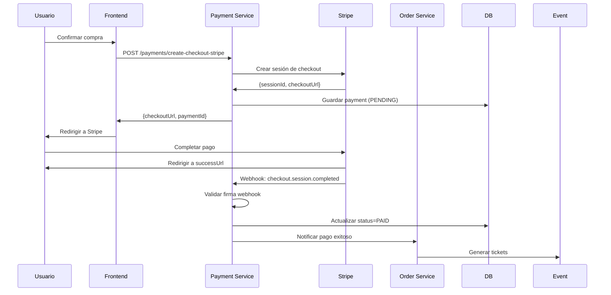

# 💳 PAYMENT-SERVICE (Stripe Integration)

Microservicio de gestión de pagos integrado con **Stripe** para el sistema PackedGo.

## 📋 Descripción

Este microservicio proporciona una **pasarela de pagos segura** que permite procesar pagos a través de Stripe Checkout. Gestiona la creación de sesiones de pago, verificación de estados y recepción de webhooks para confirmar transacciones.

### Características Principales:
- 💰 Integración completa con Stripe Checkout
- 🔔 Manejo de webhooks de Stripe
- 🔐 Validación de firmas de webhook
- 📊 Estadísticas de pagos por organizador
- 🔄 Integración con Order Service
- 🛡️ Autenticación JWT

## 🚀 Puerto de Servicio
**8085** (HTTP)
**5009** (Debug JDWP)

## 📦 Base de Datos
- **Nombre:** payment_db
- **Puerto:** 5437 (PostgreSQL 15)
- **Usuario:** payment_user
- **Imagen:** postgres:15-alpine

### Tabla principal:
  - `payments` - Registro de todos los pagos procesados

## 🚀 Tecnologías

- **Java 17** - Lenguaje de programación
- **Spring Boot 3.5.7** - Framework principal
- **Spring Data JPA** - Persistencia de datos
- **Spring Security** - Seguridad y autenticación
- **Spring Validation** - Validación de datos
- **Stripe Java SDK 26.7.0** - Integración con Stripe
- **JWT** - Autenticación basada en tokens
- **Gson** - Procesamiento JSON
- **PostgreSQL 15** - Base de datos
- **Lombok** - Reducción de boilerplate
- **Docker** - Contenedorización

## Arquitectura

```
payment-service/
 controller/
    PaymentController.java       # Endpoints API
    StripeWebhookController.java # Webhooks Stripe
 service/
    PaymentService.java          # Lógica de negocio
 dto/
    PaymentRequest.java
    PaymentResponse.java
    PaymentStatsDTO.java
 entity/
    Payment.java                 # Entidad JPA
 security/
    JwtTokenValidator.java       # Validación JWT
 config/
     StripeConfig.java            # Configuración Stripe
```

## API Endpoints

### Gestión de Pagos

**POST** `/payments/create-checkout-stripe`
Crea una sesión de Checkout en Stripe.
```json
Headers: Authorization: Bearer {token}
Body: {
  "adminId": 1,
  "orderId": "ORD-202510-123",
  "amount": 1500.00,
  "currency": "usd",
  "successUrl": "https://myapp.com/success",
  "cancelUrl": "https://myapp.com/cancel"
}
Response: 201 CREATED
{
  "checkoutUrl": "https://checkout.stripe.com/c/pay/...",
  "sessionId": "cs_test_...",
  "paymentId": 123
}
```

**POST** `/payments/verify/{orderId}`
Verificación manual del estado de un pago (útil si el webhook falla).
```json
Response: 200 OK
{
  "status": "PAID",
  "orderId": "ORD-202510-123"
}
```

**GET** `/payments/stats`
Obtiene estadísticas de pagos para el administrador autenticado.
```json
Headers: Authorization: Bearer {token}
Response: 200 OK
{
  "totalRevenue": 5000.00,
  "successfulPayments": 45,
  "pendingPayments": 2
}
```

### Webhooks

**POST** `/api/webhooks/stripe`
Endpoint público para recibir notificaciones de Stripe.
- Evento manejado: `checkout.session.completed`
- Valida la firma `Stripe-Signature`

### Health Check

**GET** `/payments/health`
```json
{
  "status": "UP",
  "service": "payment-gateway",
  "version": "2.0.0",
  "provider": "Stripe"
}
```

## Configuración

Variables de entorno requeridas en `.env` o `application.properties`:

```properties
# Server
SERVER_PORT=8085

# Stripe Keys
STRIPE_API_KEY=sk_test_...  # Clave secreta de Stripe (NUNCA compartir)
STRIPE_WEBHOOK_SECRET=whsec_...  # Secret para validar webhooks

# Database
DB_URL=jdbc:postgresql://payment-db:5432/payment_db
DB_USERNAME=payment_user
DB_PASSWORD=payment_password

# JWT
JWT_SECRET=mySecretKey123456789PackedGoAuth2025VerySecureKey

# External Services
ORDER_SERVICE_URL=http://order-service:8084
```

## 🐳 Ejecución con Docker

### Desde el directorio raíz del backend:
```bash
docker-compose up -d payment-service
```

### Logs del servicio:
```bash
docker-compose logs -f payment-service
```

### Variables de entorno en docker-compose:
Asegurar que el archivo `.env` esté configurado con las claves de Stripe.

## 🔧 Desarrollo Local

### Requisitos:
- Java 17+
- Maven 3.8+
- PostgreSQL 15+ (o usar Docker)
- Cuenta de Stripe (modo test)

### Ejecutar localmente:
```bash
./mvnw spring-boot:run
```

### Compilar:
```bash
./mvnw clean package
```

## 💳 Flujo de Pago Completo



### Paso a Paso:

1. **Frontend** envía solicitud de pago a `/payments/create-checkout-stripe`.
2. **Payment Service** crea una sesión en Stripe y devuelve la URL de checkout.
3. **Frontend** redirige al usuario a la página de pago de Stripe.
4. **Usuario** completa el pago con tarjeta.
5. **Stripe** redirige al usuario a la `successUrl` configurada.
6. **Stripe** envía un webhook asíncrono a `/api/webhooks/stripe`.
7. **Payment Service** valida la firma del webhook (`Stripe-Signature` header).
8. **Payment Service** actualiza el estado del pago a `PAID`.
9. **Payment Service** notifica al `order-service` para confirmar la orden.
10. **Order Service** solicita generación de tickets a `event-service`.

## 🔐 Seguridad

### Validación de Webhooks
```java
// Validación de firma Stripe
String payload = request.body();
String sigHeader = request.header("Stripe-Signature");

Event event = Webhook.constructEvent(
    payload, sigHeader, webhookSecret
);
```

### Endpoints Protegidos
- Todos los endpoints de pagos requieren `Authorization: Bearer {token}`
- El webhook `/api/webhooks/stripe` es público pero validado por firma

### Estados de Pago
```java
public enum PaymentStatus {
    PENDING,     // Sesión creada, pago no completado
    PAID,        // Pago exitoso confirmado por webhook
    FAILED,      // Pago rechazado o error
    REFUNDED,    // Pago reembolsado
    CANCELLED    // Sesión cancelada por usuario
}
```

## 🔗 Integración con Otros Servicios

### ORDER-SERVICE (Outbound)
- **Propósito:** Notificar cuando un pago es confirmado
- **URL:** Configurada en `ORDER_SERVICE_URL`
- **Endpoint:** `/api/orders/payment-callback`

## ⚠️ Manejo de Errores

| Código | Error | Descripción |
|--------|-------|-------------|
| 200 | OK | Operación exitosa |
| 201 | Created | Sesión de pago creada |
| 400 | Bad Request | Firma de webhook inválida o datos incorrectos |
| 401 | Unauthorized | Token JWT inválido o faltante |
| 404 | Not Found | Pago no encontrado |
| 500 | Internal Server Error | Error de comunicación con Stripe |

## 🧪 Testing con Stripe

### Tarjetas de Prueba:
```
Éxito:          4242 4242 4242 4242
Fallo:          4000 0000 0000 0002
Requiere 3DS:   4000 0025 0000 3155
```

### Stripe CLI para Webhooks Locales:
```bash
# Instalar Stripe CLI
stripe login

# Escuchar webhooks localmente
stripe listen --forward-to localhost:8085/api/webhooks/stripe

# Esto genera un webhook secret temporal para desarrollo
```

### Simular Webhook Manual:
```bash
stripe trigger checkout.session.completed
```

## 📊 Entity: Payment

```java
@Entity
@Table(name = "payments")
public class Payment {
    private Long id;
    private Long adminId;              // ID del organizador
    private String orderId;            // ID de la orden en order-service
    private BigDecimal amount;         // Monto del pago
    private String currency;           // Moneda (usd, ars, etc.)
    private PaymentStatus status;      // PENDING, PAID, FAILED, etc.
    private String stripeSessionId;    // ID de sesión de Stripe
    private String stripePaymentId;    // ID del pago en Stripe
    private LocalDateTime createdAt;
    private LocalDateTime updatedAt;
}
```

## 📝 Notas de Desarrollo

- **Modo Test vs Producción:** Usar claves de API diferentes según ambiente
- **Webhooks:** En producción, configurar la URL del webhook en el dashboard de Stripe
- **Monedas:** Stripe soporta múltiples monedas (configurar según región)
- **Reintento de Webhooks:** Stripe reintenta automáticamente si falla
- **Logs:** Los webhooks exitosos se registran en logs del servicio
- **Idempotencia:** Stripe garantiza que los webhooks son idempotentes

## 🔄 Próximas Mejoras

- [ ] Implementar refunds (reembolsos)
- [ ] Soporte para pagos recurrentes (suscripciones)
- [ ] Integración con MercadoPago (alternativa regional)
- [ ] Dashboard de reportes de pagos
- [ ] Notificaciones por email tras pago exitoso
- [ ] Manejo de pagos parciales o en cuotas
